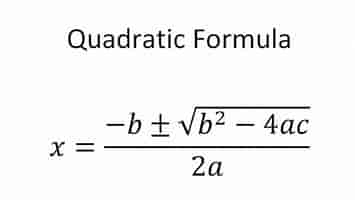
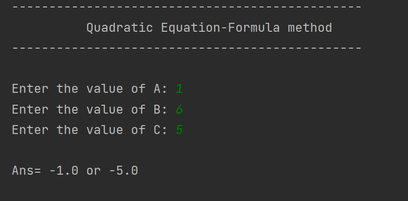

#Quadratic Equation-Formula method 
<hr>

In algebra, a quadratic equation (from the Latin quadratus for "square") is any equation that can be rearranged in standard form as
 
```ax^{2}+bx+c=0}ax^{2}+bx+c=0``` 

where x represents an unknown, and a, b, and c represent known numbers, where a ≠ 0. If a = 0, then the equation is linear, not quadratic, as there is no {\displaystyle ax^{2}}ax^2 term. The numbers a, b, and c are the coefficients of the equation and may be distinguished by calling them, respectively, the quadratic coefficient, the linear coefficient and the constant or free term.[more](en.wikipedia.org/wiki/Quadratic_equation)

##[Formula method](https://www.cuemath.com/algebra/quadratic-equations/#:~:text=1%20The%20standard%20form%20of%20a%20quadratic%20equation,0%20is%20%3A%20%28%E2%88%9E%2C%20-%20%28b2%20-%204ac%29%2F4a%5D)


